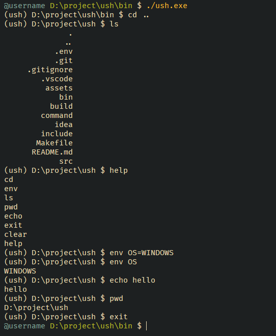

# USH - Custom Shell in C
ush is a simple shell written in C, featuring built-in commands and support for custom commands

## Features
- Built-in commands are located in src/commands/loader.c
- Easily add your own custom commands
- Example custom command available in command/hello
- Core shell functions are in the include/ directory

## Installation
### Windows and Linux

**Warning:** To compile ush on Windows, use `MinGW`


```bash
git clone https://github.com/urancore/ush.git
cd ush
make
make lib  # generates static library at /lib/lush.a
```

## Adding Your Own Command
1. Place your command binary in the `command/bin/`
2. Add `command/bin/` to your PATH environment variable
3. Check out the example custom command in `command/hello/`

## Usage
Get built-in commands

```bash
help
```

## Project Structure
- `src/commands/loader.c` - loader for built-in commands
- `command/bin/` - binaries for custom commands
- `command/hello/` - example custom command
- `include/` - shell function headers
- `lib/lush.a` - generated static library after make lib
